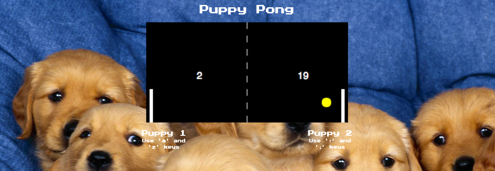

# Pong Game
Puppy Pong

##### Install

`> npm i`

##### Run

`> npm start`

## Keys

##### Player 1:
* a: up
* z: down
* q: fire a new ball

##### Player 2:
* ▲ : up
* ▼: down
* /: fire a new ball

# Languages Used
ES2015
HTML5 Canvas
CSS

# Learning Outcomes

Through the process of creating this basic puppy pong game, I have developed an understanding of ES2015, and a further understanding of the fundamentals of buliding with programming languages. In addition, I have learned how to program with the object oriented method, and combine HTML5 to create a canvas. 

